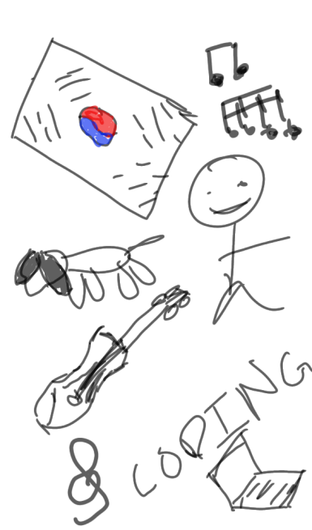

## Yeongsu's Blog

Go to my [Github account](https://github.com/YeongsuKimm) !!

## Overview of Hacks, Study and Tangibles
Blogging in GitHub pages is a way to learn and code at the same time. 

- Plans, Lists, [Scrum Boards](https://clickup.com/blog/scrum-board/) help you to track key events, show progress and record time.  Effort is a big part of your class grade.  Show plans and time spent!
- [Hacks(Todo)](https://levelup.gitconnected.com/six-ultimate-daily-hacks-for-every-programmer-60f5f10feae) enable you to stay in focus with key requirements of the class.  Each Hack will produce Tangibles.
- Tangibles or [Tangible Artifacts](https://en.wikipedia.org/wiki/Artifact_(software_development)) are things you accumulate as a learner and coder. 

<!-- ## MY PAGE -->
<h1>Hello, Welcome to my page!</h1>

<h2 style="padding-left:2em">About Me:</h2>

    
    <ol style="font-size:15px">
        <li>I was born in South Korea</li>
        <li>I have a dog   </li>
        <li>I like music</li>
        <li>I play the violin</li>
        <li>I enjoy coding</li>
    </ol>

   
<button onclick="createItem()">Create a to-do item</button>
<html>
    <head>
    </head>
    <body>
        
    </body>
</html>

