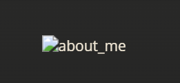
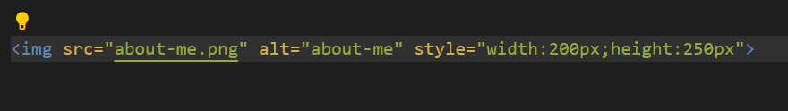
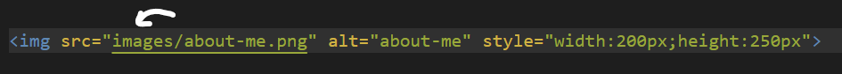
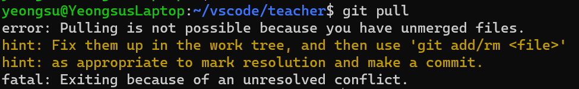

<h1>Fixed Errors</h1>
<ul>
    <li style="font-size:15px">
        Image wasn't rendering in: 
         
          
        Fix:  
        <h4>Fixed the directory</h4>
        
    </li>
</ul>
<h1>Ongoing Errors</h1>
<ul>
    <li>git pull Error 
        
    </li>    
</ul>

<h1>To-do</h1>
<ol>
    <li>create to-do item maker</li>
</ol>